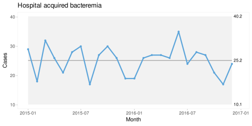

Statistical process control charts with R masterclass
================
Jacob Anhøj (<jacob@anhoej.net>) 
October 2021

-   [What will you learn?](#what-will-you-learn)
-   [Who are you?](#who-are-you)
-   [How should you prepare for the
    masterclass?](#how-should-you-prepare-for-the-masterclass)
-   [Who am I?](#who-am-i)
-   [Further up, further in](#further-up-further-in)

------------------------------------------------------------------------

This one-day masterclass is for R programmers who want to learn
statistical process control (SPC) for continuous quality improvement.

*Statistical Process Control is not about statistics, it is not about
“process-hyphen-control”, and it is not about conformance to
specifications. \[…\] It is about the continual improvement of processes
and outcomes. And it is, first and foremost, a way of thinking with some
tools attached. – Donald Wheeler, Understanding Variation, 2nd
ed. p. 152*

In this masterclass you will learn the tools, most notably the process
control chart, which is a simple an elegant graph that helps to
distinguish between common and special cause variation in processes in
time or space.

<!-- -->

The control chart above shows the monthly number of hospital acquired
bacteremias in a large university hospital. Since all data points fall
between the control limits (grey area), which represent the natural
(common cause) variation, the process is said to be stable, meaning
predictable. That is, if nothing changes, we should in the future expect
on average 25 and no less than 10 and no more than 40 cases per month.
If, on the other hand, one or more data points show up outside the
control limits that would be a signal that the process is changing (for
better or worse), and that you should seek to find the special cause
that produced that change.

## What will you learn?

As mentioned, the main focus of this masterclass is on the tools – how
to construct and interpret basic control charts.

After the masterclass you will be able to …

-   construct I, C, U, and P control charts according to [Mohammed
    2008](https://doi.org/10.1136/qshc.2004.012047) using base R
    functions;

-   apply different statistical rules to identify special cause
    variation;

-   explain how different rules affect the chart’s sensitivity and
    specificity;

-   explain how to reconcile the voice of the process (the control
    chart) with the voice of the customer (specifications and
    standards);

-   construct multidimensional (faceted) and multi-part control charts
    using functions from the
    [qicharts2](https://anhoej.github.io/qicharts2/) package.

The masterclass is 100% PowerPoint-free and contains a mixture of
lecturing, discussion, Q&A, live R coding, and exercises. During the
day, you will build your own [R function for control chart
construction](R/r4spc_solution.R).

## Who are you?

You may be an analyst, data scientist, statistician, healthcare
professional, researcher – or somebody else – with an interest in
continuous quality improvement and an affinity for numbers and
programming.

You …

-   are familiar with the basic ideas of SPC, specifically the
    distinction between common cause and special cause variation;

-   have experience using the R programming language to manipulate,
    analyse, and plot data;

-   understand basic statistical concepts including probability,
    population, sample, distribution, and measures of central tendency
    and dispersion.

## How should you prepare for the masterclass?

First, download the course files:

-   <https://raw.githubusercontent.com/anhoej/r4spc/main/R/r4spc_solution.R>
-   <https://raw.githubusercontent.com/anhoej/r4spc/main/R/qicharts2_examples.R>

… or get everything from the GitHub repo:
<https://github.com/anhoej/r4spc> (click the green `Code` button, then
`Download ZIP`).

Next, to get the most out of the masterclass and to help the masterclass
to a flying start it is important that you have the necessary knowledge
and skills mentioned above.

To shape your SPC thinking you should have read these two articles:

1.  Anhøj J, Hellesøe AB. The problem with red, amber, green: the need
    to avoid distraction by random variation in organisational
    performance measures. doi:
    [10.1136/bmjqs-2015-004951](https://doi.org/10.1136/bmjqs-2015-004951).

2.  Mohammed MA, Worthington P, Woodall WH. Plotting basic control
    charts: tutorial notes for healthcare practitioners. Qual Saf Health
    Care. 2008 Apr;17(2):137-45. doi:
    [10.1136/qshc.2004.012047](https://doi.org/10.1136/qshc.2004.012047).
    If you are working in the NHS, here is a direct [link to the full
    paper](https://qi.elft.nhs.uk/wp-content/uploads/2018/10/Mohammed-et-al-2008-Plotting-basic-control-charts.pdf).

Finally, you need to bring a computer with a recent versions of
[R](https://www.r-project.org/) (≥ 4.1), [RStudio](https://rstudio.com/)
(≥ 1.4), and the [qicharts2](https://anhoej.github.io/qicharts2/)
package installed.

**Please check that your R installation is fully functional** as there
will be no time during the masterclass to fix individual installation
problems.

You may want to set a day aside at least one week before the masterclass
to prepare. Just saying 😉

## Who am I?

I am a medical doctor working at
[Rigshospitalet](https://www.rigshospitalet.dk/english/Pages/default.aspx)
in Copenhagen, Denmark. I graduated in 1992 and after nine years of
clinical work and research I worked for four years in a pharmaceutical
company with research and health IT while studying information
technology at the IT University of Copenhagen. Since 2005 I have worked
almost exclusively with patient safety and quality improvement in
healthcare. My main interest and area of research is use of statistical
methods in quality improvement. At present, my main job involves
[surveillance of hospital infections and antibiotic
use](https://regionh.shinyapps.io/hais/) in the Capital Region of
Denmark.

I have used R since 1999 and am the maintainer of the
[qicharts2](https://anhoej.github.io/qicharts2/) R package.

I have written several articles on SPC:

1.  Anhøj J, Olesen AV. Run charts revisited: a simulation study of run
    chart rules for detection of non-random variation in health care
    processes. PLoS One. 2014 Nov 25;9(11):e113825. doi:
    [10.1371/journal.pone.0113825](https://doi.org/10.1371/journal.pone.0113825).

2.  Anhøj J. Diagnostic value of run chart analysis: using likelihood
    ratios to compare run chart rules on simulated data series. PLoS
    One. 2015 Mar 23;10(3):e0121349. doi:
    [10.1371/journal.pone.0121349](https://doi.org/10.1371/journal.pone.0121349).

3.  Anhøj J, Hellesøe AB. The problem with red, amber, green: the need
    to avoid distraction by random variation in organisational
    performance measures. BMJ Qual Saf. 2017 Jan;26(1):81-84. doi:
    [10.1136/bmjqs-2015-004951](https://doi.org/10.1136/bmjqs-2015-004951).

4.  Anhøj J, Wentzel-Larsen T. Sense and sensibility: on the diagnostic
    value of control chart rules for detection of shifts in time series
    data. BMC Med Res Methodol. 2018 Oct 3;18(1):100. doi:
    [10.1186/s12874-018-0564-0](https://doi.org/10.1186/s12874-018-0564-0).

5.  Wentzel-Larsen T, Anhøj J. Joint distribution for number of
    crossings and longest run in independent Bernoulli observations. The
    R package crossrun. PLoS One. 2019 Oct 1;14(10):e0223233. doi:
    [10.1371/journal.pone.0223233](https://doi.org/10.1371/journal.pone.0223233).

6.  Anhøj J, Wentzel-Larsen T. Smooth operator: Modifying the Anhøj
    rules to improve runs analysis in statistical process control. PLoS
    One. 2020 Jun 4;15(6):e0233920. doi:
    [10.1371/journal.pone.0233920](https://doi.org/10.1371/journal.pone.0233920).

## Further up, further in

SPC is almost 100 years old – older than the randomised controlled trial
– so it is no surprise that there are wast amounts of resources out
there. However, these three books are my go-to SPC resources:

1.  Donald J. Wheeler (2000). [Understanding Variation – The Key to
    Managing
    Chaos](https://www.spcpress.com/book_understanding_variation.php).
    SPC Press.

2.  Douglas C. Montgomery (2019). [Introduction to Statistical Quality
    Control](https://www.wiley.com/en-gb/Introduction+to+Statistical+Quality+Control%2C+8th+Edition%2C+EMEA+Edition-p-9781119657118).
    John Wiley & Sons.

3.  Western Electric (1956). [Statistical Quality Controll
    Handbook](https://www.westernelectric.com/library#technical).
    Western Electric.

Wheeler gives a brilliant and compelling introduction to SPC thinking,
and Montgomery delivers a comprehensive explanation of the tools of the
trade including formulas for all the basic SPC charts plus many more
advanced charts and other tools for specialist purposes. The WE handbook
is not only interesting for historical reasons, it is highly relevant
today and gives detailed instructions to the practical use and
interpretation of SPC charts.

Specifically for making control charts with R, you may find the
[qicharts2
vignette](https://anhoej.github.io/qicharts2/articles/qicharts2.html)
useful.
